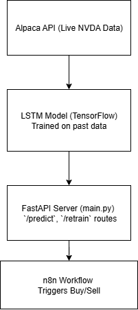

# algorithmic-stock-trader


An AI-based automated stock trading system that uses **LSTM architecture**, **FastAPI**, and **n8n workflow automation** to simulate real-time Nvidia (NVDA) stock trading by providing real-time predictions for Buy/Sell/Hold orders based on dynamic prices pulled in real-time that are carried out in Alpaca. 

---

## Features

-  Real-time Nvidia stock prediction using LSTM architecture 
-  Dynamic model retraining with NVDA prices 
-  FastAPI-powered REST endpoints for prediction and retraining
-  n8n workflow integration for automated trading decisions on Alpaca
-  Trained using historical NVDA data via Alpaca API
-  Scikit-learn MinMaxScaler for consistent scaling
-  Organized project structure and environment control

---

- ## Architecture Overview
- 

---


- ## Project Structure

- ```plaintext
nvda-trader/
├── .venv/                # Virtual environment (not tracked by Git)
├── main.py               # Main FastAPI server with ML endpoints
├── retrain_model.py      # Script to retrain LSTM model dynamically
├── nvda_lstm_model.h5    # Trained LSTM model
├── requirements.txt      # Python package dependencies
├── README.md             # Project documentation
├── architecture.png      # System architecture image
└── .gitignore            # Git ignore rules

  
---

##  How It Works

1. **Data** is fetched from Alpaca (or preloaded) and scaled.
2. **LSTM model** makes a prediction on future price movement.
3. **FastAPI** serves:
   - `/predict` → returns next price + action (buy/sell/hold)
   - `/retrain` → updates model on fresh data
4. **n8n** workflows can hit these endpoints to automate paper-trading logic

---

##  Setup Instructions

> Prerequisite: Python 3.10+ and a virtual environment (`venv` or `conda`) recommended.

1. Clone the repo:
   ```bash
   git clone https://github.com/Vasudev374/algorithmic-stock-trader.git
   cd algorithmic-stock-trader

2. Create and activate the virtual environment:
   python -m venv .venv
.\.venv\Scripts\activate   # On Windows
source .venv/bin/activate  # On Mac/Linux

3. Install dependencies
   pip install -r requirements.txt

4. Start the FastAPI server:
   uvicorn main:app --reload

---

## License

This project is licensed under the [MIT License](LICENSE).

---
   

_
##  API Usage

### `POST /predict`
Returns the model's prediction and a trading signal.

```json
{
  "predicted_price": 132.87,
  "signal": "buy"
}

```
### `POST /retrain`
Retrains the model using the most recent NVDA price data from Alpaca.

```json
{
  "status": "Retraining completed successfully"
}

```


   


